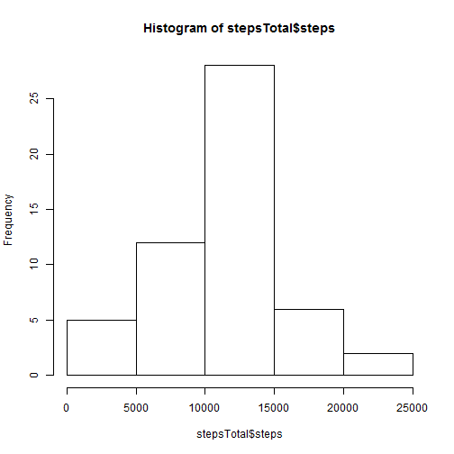
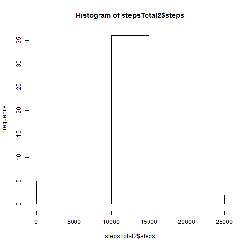
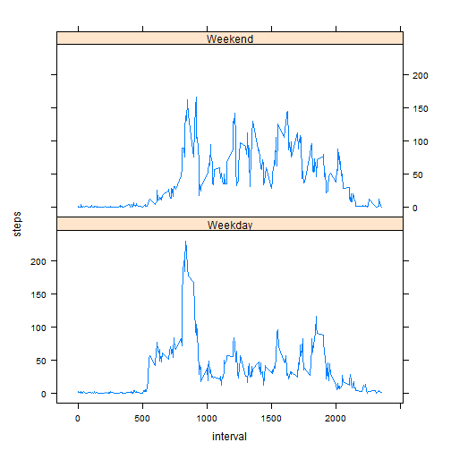

Reproducible Research: Peer Assessment 1
========================================================

Loading and preprocessing the data
----------------------------------

Loading the data:

```r
setwd("c:/tmp")
ac <- read.csv("activity.csv")
```


Preprocessing the data:

```r
stepsTotal <- aggregate(steps ~ date, data = ac, sum, na.rm = TRUE)
```


What is mean total number of steps taken per day?
-------------------------------------------------

A histogram showing total numebr of steps taken each day:

```r
hist(stepsTotal$steps)
```

 


Calculating mean and median total number of steps taken per day

```r
mean(stepsTotal$steps)
```

```
## [1] 10766
```

```r
median(stepsTotal$steps)
```

```
## [1] 10765
```


Mean total number of steps taken per day is 1.0766 &times; 10<sup>4</sup> steps.  
Median total number of steps taken per day is 10765 steps.
    
What is the average daily activity pattern?
-------------------------------------------

A time series plot (i.e. type = "l") of the 5-minute interval (x-axis) and the average number of steps taken, averaged across all days (y-axis)


```r
intervals <- aggregate(steps ~ interval, data = ac, mean, na.rm = TRUE)
plot(steps ~ interval, data = intervals, type = "l")
```

 


A 5-minute interval, on average across all the days in the dataset, containing the maximum number of steps


```r
intervals[which.max(intervals$steps), ]$interval
```

```
## [1] 835
```


Imputing missing values
-----------------------

Total number of missing values in the dataset (i.e. the total number of rows with NAs)


```r
sum(is.na(ac$steps))
```

```
## [1] 2304
```


Total number of missing values is: 2304.

Devise a strategy for filling in all of the missing values in the dataset.

I am using a mean for every 5-minute interval to replace missing values. 

```r
intervalMeans <- aggregate(steps ~ interval, data = ac, mean, na.rm = TRUE)
```


And a function which uses this set to return a mean for a particular interval:


```r
intMean <- function(interval) {
    intervalMeans[intervalMeans$interval == interval, ]$steps
}
```


Create a new dataset that is equal to the original dataset but with the missing data filled in.

Here I am using a function from previous step to replace missing NA values.


```r
acc <- ac
for (i in 1:nrow(acc)) {
    if (is.na(acc[i, ]$steps)) {
        acc[i, ]$steps <- intMean(acc[i, ]$interval)
    }
}
```


A histogram of the total number of steps taken each day and report showing the mean and median total number of steps taken per day. 


```r
stepsTotal2 <- aggregate(steps ~ date, data = acc, sum)
hist(stepsTotal2$steps)
```

 

```r
mean(stepsTotal2$steps)
```

```
## [1] 10766
```

```r
median(stepsTotal2$steps)
```

```
## [1] 10766
```


Mean total number of steps taken per day is 1.0766 &times; 10<sup>4</sup> steps.  
Median total number of steps taken per day is 1.0766 &times; 10<sup>4</sup> steps.

Do these values differ from the estimates from the first part of the assignment? 

Mean value is the same as before replacing missing data, because we took mean value for that particular interval. Median value is slightly different.

What is the impact of imputing missing data on the estimates of the total daily number of steps?

Impact is not signifficant.

Are there differences in activity patterns between weekdays and weekends?
-------------------------------------------------------------------------

Create a new factor variable in the dataset with two levels - "weekday" and "weekend" indicating whether a given date is a weekday or weekend day.


```r
acc$date <- as.Date(acc$date, "%Y-%m-%d")
days <- weekdays(acc$date)
acc$dayType <- ifelse(days == "Saturday" | days == "Sunday", "Weekend", "Weekday")
```


Make a panel plot containing a time series plot (i.e. type = "l") of the 5-minute interval (x-axis) and the average number of steps taken, averaged across all weekday days or weekend days (y-axis).


```r
intervalMeans2 = aggregate(steps ~ interval + dayType, acc, mean)
library(lattice)
xyplot(steps ~ interval | factor(dayType), data = intervalMeans2, aspect = 1/2, 
    type = "l")
```

 

